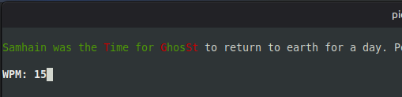

# ⌨️ Typing Speed Test (Terminal Version)

A simple **typing speed test** written in Python using the built-in `curses` library.  
The program runs entirely in the terminal and measures your typing speed in **WPM (words per minute)** or lets you **type against time**.

---

## 🧩 Features
- Terminal-based interface (no GUI needed)
- Two test modes:
  - **Live WPM** — shows your words per minute in real time  
  - **Typing in Time** — counts elapsed time as you type
- Colored feedback:
  - ✅ Green — correct letters  
  - ❌ Red — incorrect letters
- Animated blinking title
- Simple text-based menu navigation

---

## 🚀 How to Run

### 1. Requirements
- Python **3.8+**
- A terminal that supports `curses` (Linux, macOS, or Windows (Python 3.8))

### 2. Setup
Clone or download this repository, then make sure your project folder contains:
- typing_speed_test.py
- text.py

The file `text.txt` should contain the sentence(s) you want to practice typing.

### 3. Run the program
```bash
python3 typing_speed_test.py
```

## 🎮 How to Use

When the program starts, you’ll see a blinking welcome message.

1. Choose a mode:

Press 1 → WPM Live

Press 2 → Typing in Time



2. Start typing the text shown on the screen.
- Correct letters are highlighted in green
- Incorrect letters are shown in red

3. When finished, press Enter to see your results:

- WPM (Words Per Minute)

- Number of wrong and right letters

---

## 📄 License

This project is released under the MIT License — feel free to use, modify, and share.

---

## 👨 Author

‍💻 Created by Piotr Frasik\
🕹️ Python curses-based typing test
